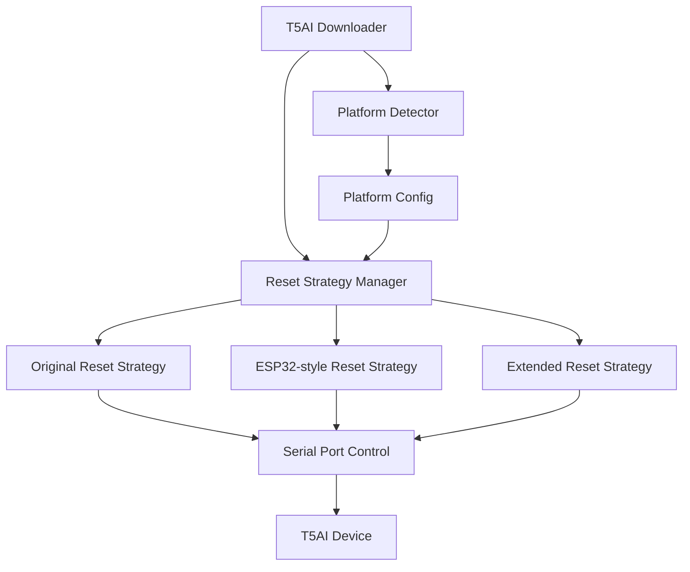

# Design Document

## Overview

本设计文档描述了如何解决T5AI固件烧录工具在Ubuntu Linux系统上无法自动复位设备的问题。通过分析Windows和Ubuntu系统上的行为差异，以及参考web-downloader中ESP32的成功实现，我们将设计一个多策略的复位系统，能够自动适配不同的操作系统环境。

## Architecture

### 核心组件

1. **平台检测器 (PlatformDetector)**
   - 检测当前运行的操作系统
   - 提供平台特定的配置参数
   - 支持Windows、macOS、Linux的识别

2. **复位策略管理器 (ResetStrategyManager)**
   - 管理多种复位策略
   - 按优先级尝试不同的复位方法
   - 记录成功的策略以供后续使用

3. **增强的T5AI下载器 (Enhanced T5AI Downloader)**
   - 集成平台检测和多策略复位
   - 保持向后兼容性
   - 提供详细的调试日志

### 系统架构图



## Components and Interfaces

### PlatformDetector

```javascript
class PlatformDetector {
    static detectPlatform() {
        // 返回: 'windows', 'macos', 'linux', 'unknown'
    }
    
    static getPlatformConfig(platform) {
        // 返回平台特定的配置对象
    }
}
```

**配置参数:**
- `resetDelay`: 复位信号持续时间
- `recoveryDelay`: 复位后恢复时间
- `linkCheckDelay`: LinkCheck命令间隔
- `maxRetries`: 最大重试次数

### ResetStrategyManager

```javascript
class ResetStrategyManager {
    constructor(port, platformConfig) {}
    
    async executeReset() {
        // 按优先级尝试不同策略
    }
    
    async tryOriginalStrategy() {
        // T5AI原始复位策略: DTR=false, RTS=true -> RTS=false
    }
    
    async tryESP32Strategy() {
        // ESP32风格复位策略: DTR=false -> DTR=true
    }
    
    async tryExtendedStrategy() {
        // 扩展复位策略: 更长的延迟和多次尝试
    }
}
```

### Enhanced T5AI Downloader

修改现有的`T5Downloader`类，集成新的复位系统：

```javascript
class T5Downloader extends BaseDownloader {
    constructor(serialPort, debugCallback) {
        super(serialPort, debugCallback);
        this.platformDetector = new PlatformDetector();
        this.resetStrategyManager = null;
    }
    
    async getBusControl() {
        // 使用新的复位策略管理器
    }
}
```

## Data Models

### PlatformConfig

```javascript
const PlatformConfigs = {
    windows: {
        resetDelay: 300,
        recoveryDelay: 4,
        linkCheckDelay: 1,
        maxRetries: 100,
        preferredStrategy: 'original'
    },
    linux: {
        resetDelay: 500,      // 增加复位延迟
        recoveryDelay: 10,    // 增加恢复延迟
        linkCheckDelay: 2,    // 增加LinkCheck延迟
        maxRetries: 100,
        preferredStrategy: 'esp32'  // 优先使用ESP32策略
    },
    macos: {
        resetDelay: 300,
        recoveryDelay: 4,
        linkCheckDelay: 1,
        maxRetries: 100,
        preferredStrategy: 'original'
    }
};
```

### ResetStrategy

```javascript
const ResetStrategies = {
    original: {
        name: 'T5AI Original',
        description: 'DTR=false, RTS=true -> RTS=false',
        execute: async (port, config) => { /* 实现 */ }
    },
    esp32: {
        name: 'ESP32 Style',
        description: 'DTR=false -> DTR=true',
        execute: async (port, config) => { /* 实现 */ }
    },
    extended: {
        name: 'Extended Timing',
        description: 'Original with extended delays',
        execute: async (port, config) => { /* 实现 */ }
    }
};
```

## Error Handling

### 复位失败处理

1. **策略失败**: 当某个复位策略失败时，自动尝试下一个策略
2. **全部失败**: 当所有策略都失败时，提供详细的错误信息和建议
3. **平台特定建议**: 根据检测到的平台提供相应的故障排除建议

### 错误信息设计

```javascript
const ErrorMessages = {
    linux: {
        resetFailed: '在Linux系统上复位失败。建议检查：\n1. USB线缆连接\n2. 设备权限设置\n3. 尝试手动复位设备',
        permissionDenied: 'Linux系统串口权限不足，请将用户添加到dialout组'
    },
    windows: {
        resetFailed: '在Windows系统上复位失败。建议检查：\n1. 驱动程序安装\n2. 设备管理器中的串口状态',
        driverIssue: 'Windows驱动程序问题，请重新安装USB串口驱动'
    }
};
```

## Testing Strategy

### 单元测试

1. **PlatformDetector测试**
   - 测试不同User-Agent字符串的平台识别
   - 验证平台配置的正确性

2. **ResetStrategyManager测试**
   - 模拟串口操作测试各种复位策略
   - 测试策略切换逻辑

3. **T5Downloader集成测试**
   - 测试新复位系统与现有代码的集成
   - 验证向后兼容性

### 集成测试

1. **跨平台测试**
   - 在Windows、macOS、Linux上测试复位功能
   - 验证平台特定配置的有效性

2. **设备兼容性测试**
   - 测试不同版本的T5AI设备
   - 验证复位策略的通用性

### 用户验收测试

1. **Ubuntu系统测试**
   - 在真实Ubuntu环境中测试T5AI复位功能
   - 验证用户体验的改善

2. **回归测试**
   - 确保Windows系统上的功能不受影响
   - 验证现有用户工作流程的兼容性

## Performance Considerations

### 复位时间优化

1. **智能策略选择**: 记录成功的策略，下次优先使用
2. **并行检测**: 在连接过程中并行执行平台检测
3. **缓存配置**: 缓存平台配置以避免重复检测

### 内存使用

1. **轻量级实现**: 新增组件保持轻量级设计
2. **按需加载**: 只加载当前平台需要的配置
3. **资源清理**: 确保串口资源的正确释放

## Security Considerations

### 串口访问安全

1. **权限检查**: 在Linux系统上检查串口访问权限
2. **错误处理**: 安全地处理权限不足的情况
3. **资源保护**: 防止串口资源泄露

### 平台检测安全

1. **输入验证**: 验证User-Agent字符串的安全性
2. **默认配置**: 为未知平台提供安全的默认配置
3. **错误边界**: 防止平台检测失败影响整体功能